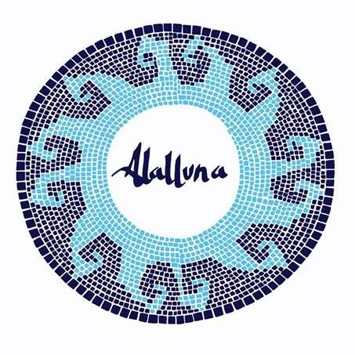

# Alalluna

## Intro

Alalluna app allows you to teach and learn arts comfortably from your home, it also serves as a complement to a traditional arts academy. Interact, share, enjoy and learn art with us

## Functional Description

Alalluna  app is a responsive application for studying arts, where teachers can share lessons and documentation about arts, look and correct their students' works. The students can share their works and learn basic concepts of drawing, painting, composition and other concepts. It also includes a group chat to ask questions and you can share the necessary links to the theory, documentation and links of interest. Finally this app includes a materials section so that students have within reach all the necessary tools for each exercise.

### Use Cases

#### For teacher

- View all works
- View my works in profile (list of works of the logged in user)
- View users works (user's works list)
- Publish my works
- Edit any work of a user (only title and description)
- Delete any work of a user
- Add comment form some work
- Delete comment from some work
- Edit comment from some work
- Register new teacher

- Create lesson (work in progress)
- Edit lesson (work in progress)
- Delete lesson (work in progress) 
- View list of all lessons and own lessons (work in progress)

#### For students

- View all works
- View my works in profile (list of works of the logged in user)
- View users works (user's works list)
- Publish my work
- Edit only my work (only title and description)
- Delete only my work
- View comments (from work of every students)

- View list of all lessons and lessons of some teacher (work in progress)

### UI Design

Figma

https://www.figma.com/design/TaAkM7JZWBW6s9Qxw5XMWV/project-academy-online?node-id=0-1&t=jJyJlYurmzM0ruob-0

## Technical Description

### Technologies

- JavaScript
- React
- Node
- Express
- Mongo
- Tailwind
- JWT

## Modules

- API (server)
- App (client)
- Com (utils common)
- Doc (Readme)

### Data Model

MVP

User
- Id (string, required)
- Name (string, required)
- Surname (string, required)
- Email (string, required, unique)
- Password (string, required)
- Role (string, required, enum: student|teacher)

Work (student)
- Id (string, required)
- UserId(string,required)
- Title (string, required)
- Image (string, required)
- Description (string)
- Date (date, required)

Comment
- Id (auto)
- Teacher (User.id)
- Work (Work.id)
- Text (string, required)
- Date (date, required)

VERSION TWO 

Lesson of teachers(work in progress)
- Id (auto)
- Teacher(User.id)
- Title (string, required)
- Image (string)
- Description (string, required)
- Prezi link(string)
- Video (string)
- Date (date, required)
